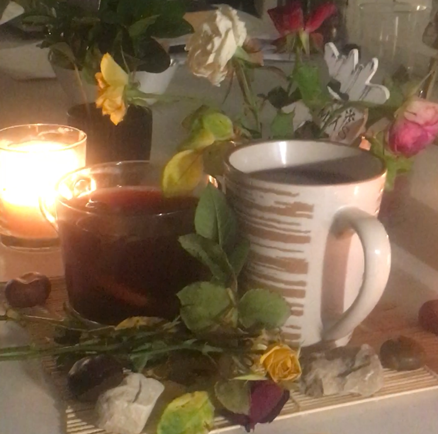

Here are some of special beverages to bring a pinch of magic into your autumn.
Do not hesitate and try them all!

- Mulled wine

---

_Mulled wine_ (or _spice wine_) is a traditional Nordic alcohol drink (called there Gløgg) during Christmas time but I don't find better way to enjoy it rather than in the middle of fall.
Made from red wine, fruits and bunch of seducive spices, like cinammon, star anise, nutmeg, ginger, and carnation.
Pieces of fresh orange or dry peels usually are added as well. You can experiment with different flavours – try addding cranberry juice, lemon or raisins to your magic cup.
Adding whole sticks and grains of spices is also much better than putting everything in powder form.
What I adore about mulled wine – is that it both tastes good and relaxes you better than anything in the evening. And what makes it good to drink outside in winter is of course its hot temperature!
Mulled wine is cooked until it reaches ariund 80 degrees Celsius, however, boiling can extract hevy alcohols from it and is highly not recommended.

- Cacao with marshmallows
- Pumpkin spicy latter
- Citrus tea
- Kissel
